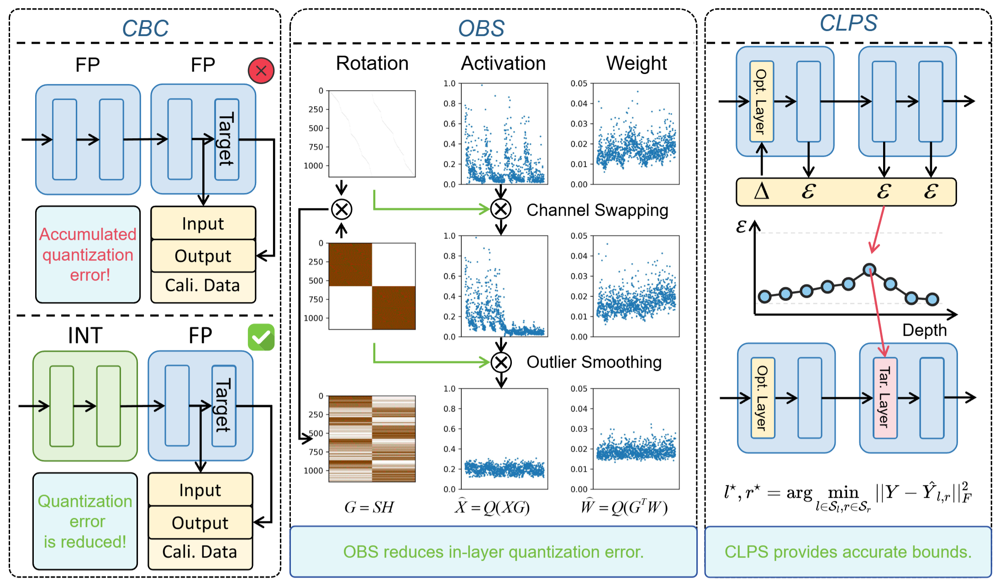
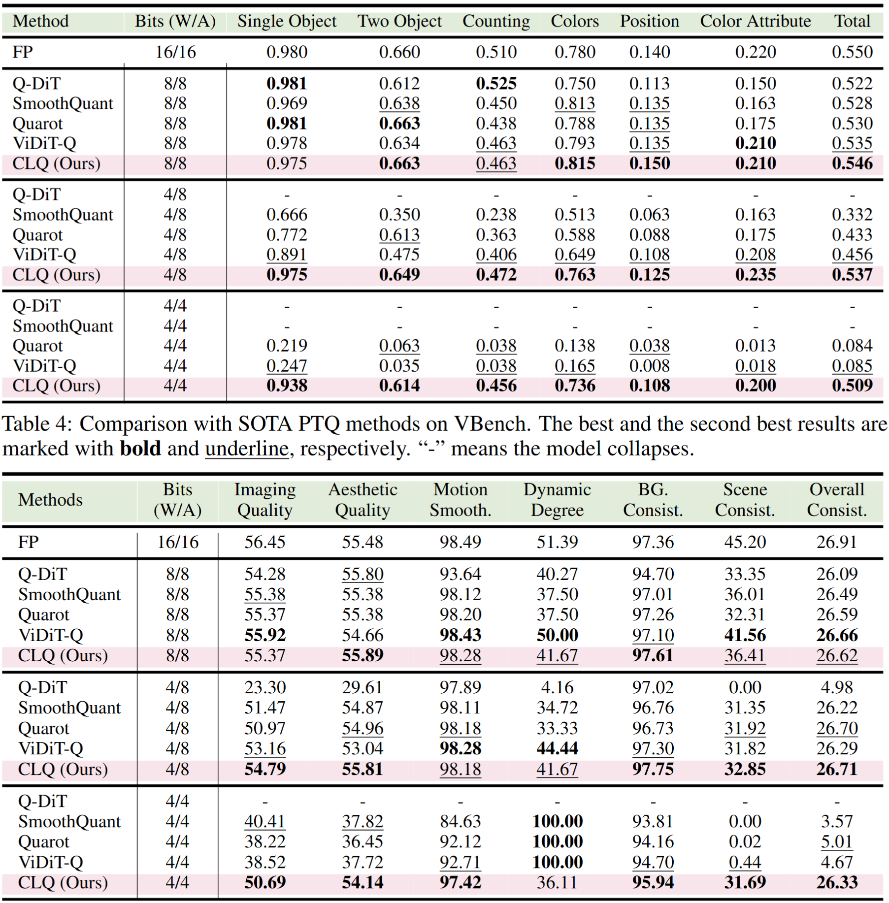
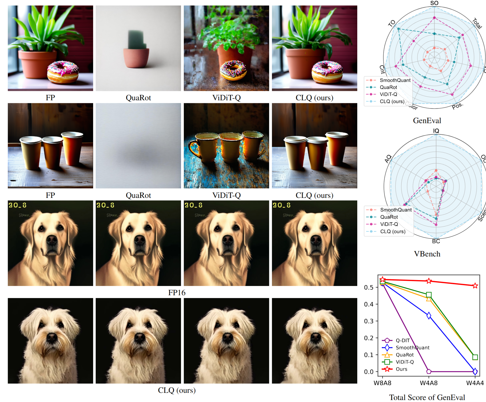
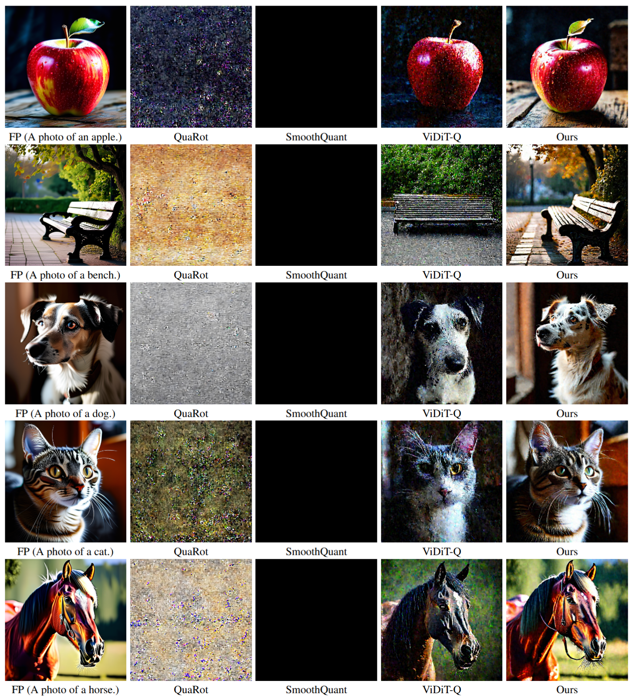
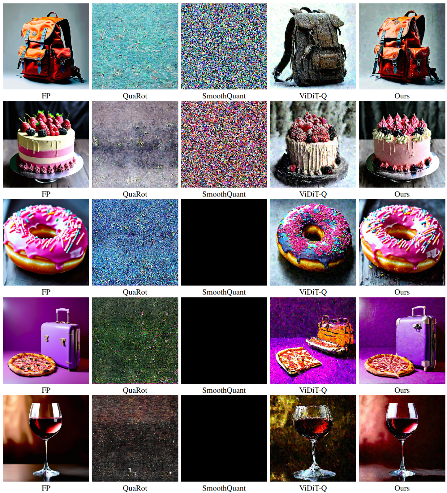
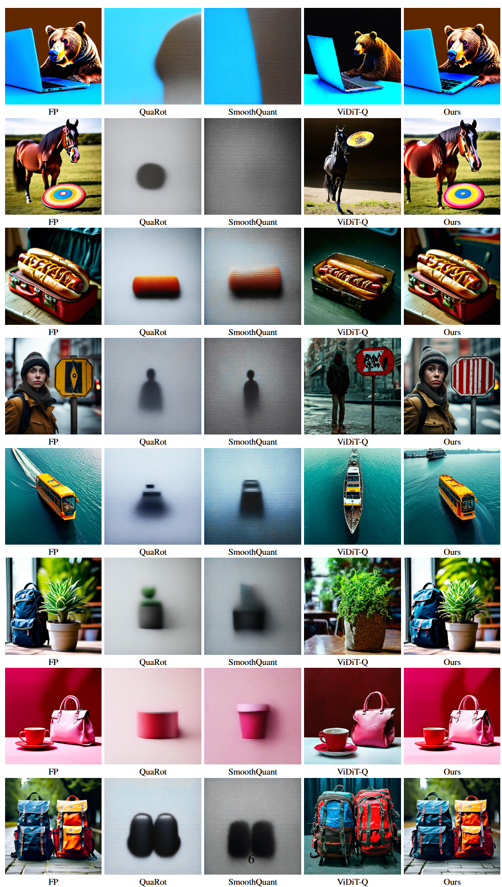
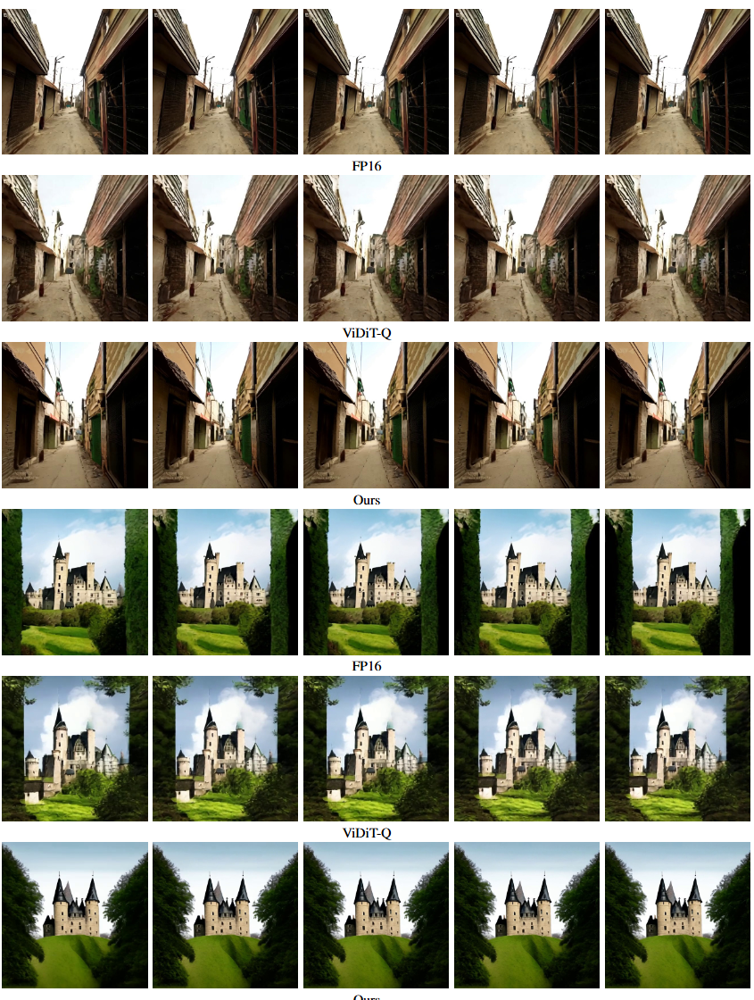
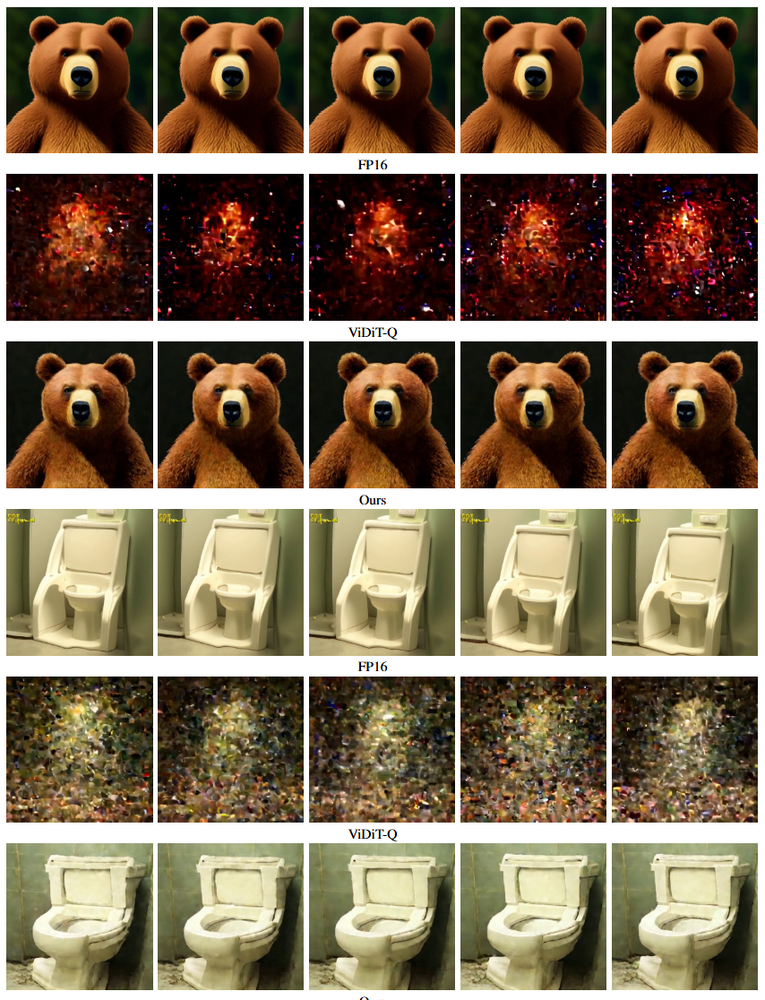

# CLQ: Cross-Layer Guided Orthogonal-based Quantization for Diffusion Transformers

[Kai Liu](https://kai-liu.cn/), [Shaoqiu Zhang](https://qiushao-e.github.io/), [Linghe Kong](https://www.cs.sjtu.edu.cn/~linghe.kong/), and [Yulun Zhang](http://yulunzhang.com/),

"CLQ: Cross-Layer Guided Orthogonal-based Quantization for Diffusion Transformers", arXiv, 2025

[[arXiv]()] [[Supplementary Material]()]


#### 🔥🔥🔥 News
- **2025-09-29:** Repo is released. ⭐️⭐️⭐️


---

> **Abstract:** Visual generation quality has been greatly promoted with the rapid advances in diffusion transformers (DiTs), which is attributed to the scaling of model size and complexity. However, these attributions also hinder the practical deployment of DiTs on edge devices, limiting their development and application. Serve as an efficient model compression technique, model post-training quantization (PTQ) can reduce the memory consumption and speed up the inference, with inevitable performance degradation. To alleviate the degradation, we propose CLQ, a cross-layer guided orthogonal-based quantization method for DiTs. To be specific, CLQ consists of three key designs. First, we observe that the calibration data used by most of the PTQ methods can not honestly represent the distribution of the activations.  Therefore, we propose cross-block calibration (CBC) to obtain accurate calibration data, with which the quantization can be better guided. Second, we propose orthogonal-based smoothing (OBS), which quantifies the outlier score of each channel and leverages block Hadamard matrix to smooth the outliers with negligible overhead. Third, we propose cross-layer parameter searching (CLPS) to search. We evaluate CLQ with both image generation and video generation models and successfully compress the model into W4A4 with negligible degradation in visual quality and metrics. CLQ achieves 3.98x memory saving and 3.95x speedup with real-world deployment testing. Our code will be released soon.




---

---


## <a name="contents"></a> Contents

- [Contents](#contents)
- [Results](#results)
- [Citation](#citation)


## <a name="results"></a> Results


<details>
<summary>Click to expand</summary>

- quantitative comparisons in Table 3 (main paper)

<p align="center">
  
</p>

- visual comparison in Figure 1 (main paper)

<p align="center">
  
</p>

- visual comparison in Figure 5 (main paper)

<p align="center">
  
</p>

- visual comparison in Figure 2 (supplemental material)

<p align="center">
  
</p>

- visual comparison in Figure 3 (supplemental material)

<p align="center">
  
</p>

- visual comparison in Figure 4 (supplemental material)

<p align="center">
  
</p>

- visual comparison in Figure 5 (supplemental material)

<p align="center">
  
</p>

</details>

## <a name="citation"></a> Citation
If you find the code helpful in your research or work, please cite the following paper(s).

```
@inproceedings{liu2025clq,
    title={CLQ: Cross-Layer Guided Orthogonal-based Quantization for Diffusion Transformers},
    author={Liu, Kai and Zhang, Shaoqiu and Kong, Linghe and Zhang, Yulun},
    booktitle={arXiv preprint arXiv:XXXX.XXXXX},
    year={2025}
}
```